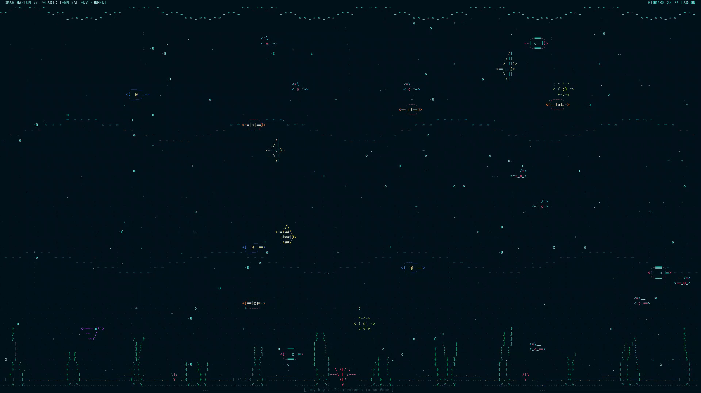
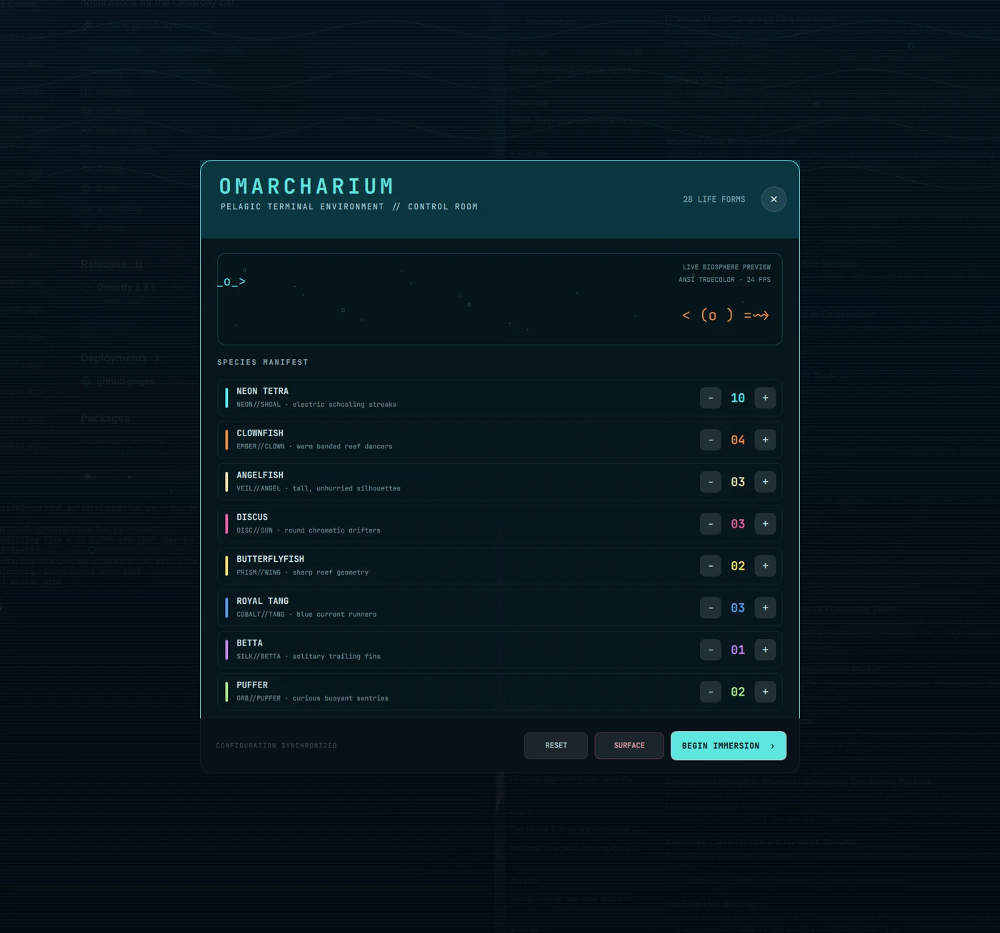
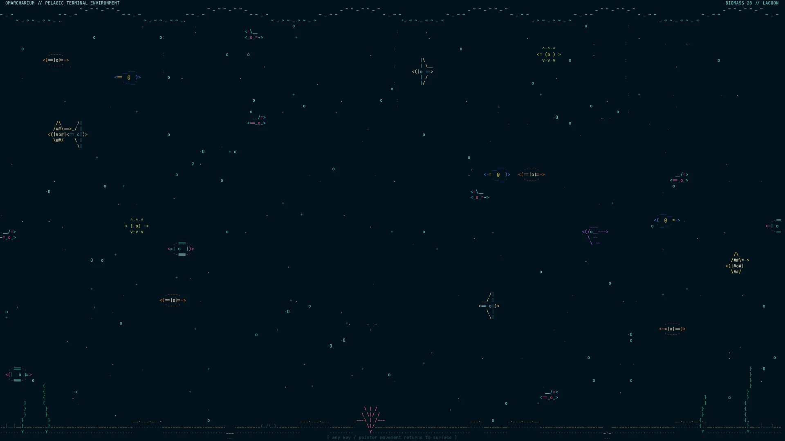
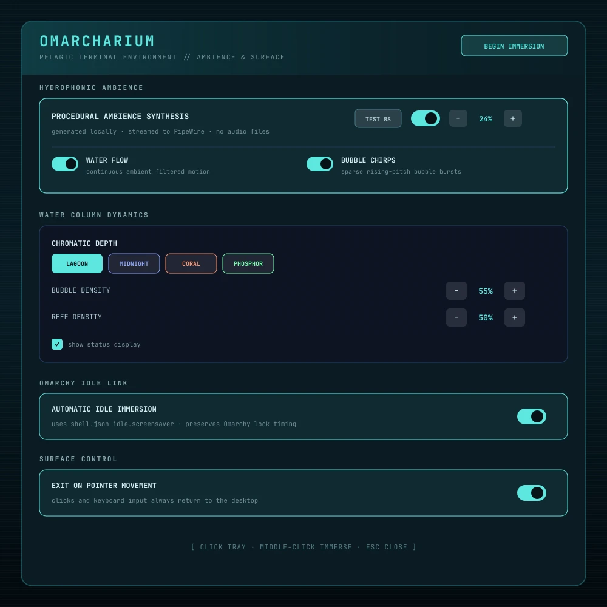

# Omarcharium

[](https://github.com/DailenG/omarcharium/releases/latest)
[](https://github.com/DailenG/omarcharium/actions/workflows/ci.yml)
[](LICENSE)
[](https://omarchy.org/)

A living, terminal-native tropical aquarium for Omarchy. Omarcharium turns every monitor into a TTE-inspired reef with eight independently configurable species, procedural water ambience, multi-monitor choreography, and an original tray-hosted control room.

**[Website](https://daileng.github.io/omarcharium/)** · **[Latest release](https://github.com/DailenG/omarcharium/releases/latest)** · **[Configuration reference](docs/CONFIGURATION.md)** · **[Report a bug](https://github.com/DailenG/omarcharium/issues/new/choose)**



> No pip packages. No remote assets. No installer hooks. No privileged writes. Just Omarchy, Python, ANSI truecolor, and a carefully bounded reef simulation.

## Why Omarcharium

- **Eight distinct tropical species** — neon tetra shoals, clownfish, angelfish, discus, butterflyfish, royal tangs, bettas, and puffers, each with its own silhouette, palette, speed, depth preference, and fin cycle.
- **A living terminal habitat** — animated caustics, drifting motes, bubble columns, swaying kelp, branching coral, sand ridges, and depth-aware drawing.
- **Four complete chromatic depths** — Lagoon, Midnight, Coral, and Phosphor.
- **Optional procedural ambience** — water movement and rising bubble chirps synthesized locally and streamed as raw PCM to PipeWire.
- **Omarchy-native lifecycle** — one fullscreen terminal per monitor, standard screensaver window identity, inhibitor-aware idle timing, and unchanged lock behavior.
- **A real control room** — exact populations, water dynamics, audio testing, idle integration, start, stop, reset, pointer controls, and keyboard navigation.
- **Conservative system behavior** — preserves user-owned toggles, never modifies packaged Omarchy files, and cleans up every terminal and runtime state it owns.

## Gallery

<table>
  <tr>
    <td width="50%"></td>
    <td width="50%"></td>
  </tr>
  <tr>
    <td align="center"><strong>Tray-hosted control room</strong><br />Local status, image backdrops, and layered environmental controls.</td>
    <td align="center"><strong>Terminal reef in motion</strong><br />Truecolor fish, caustics, bubbles, kelp, coral, and a local status display.</td>
  </tr>
</table>

<p align="center">
  
  <br />
  <strong>Water column, audible PipeWire diagnostic, and Omarchy idle integration</strong>
</p>

## Install

```bash
omarchy plugin add https://github.com/DailenG/omarcharium --enable
```

The aquarium icon appears in the system tray. Click it to open the control room, middle-click it to begin an immersion immediately, or right-click it for the concise action menu.

### Update

```bash
omarchy plugin update dailen.omarcharium
```

Saved habitat settings survive updates. Restart the shell only if an update does not hot-reload:

```bash
omarchy restart shell
```

## Requirements

Omarcharium targets the current Omarchy Quattro shell and uses tools already present on a standard installation:

- Python 3.11+
- Alacritty, Foot, Ghostty, or Kitty
- Hyprland, `jq`, and `socat`
- PipeWire's `pw-cat` only when procedural ambience is enabled
- ImageMagick's `magick` only when custom raster or ASCII-fied backdrops are selected

No Python package, compiled extension, bundled recording, network service, or second Quickshell process is required.

## Use

| Action | Result |
|---|---|
| Click tray icon | Open or return to the control room |
| Middle-click tray icon | Begin immersion immediately |
| Right-click tray icon | Open Control Room, Immerse Now, or Report Bug |
| **Begin Immersion** | Save parameters and launch on every monitor |
| **Surface** | Close every active aquarium window |
| **Test 8s** | Play three diagnostic tones, then generated water ambience |
| Any key or click | Return to the desktop from the screensaver |
| Pointer motion | Return to the desktop when **Exit on pointer movement** is enabled |
| Escape | Close the control room |
| Enter | Begin immersion from the control room |
| Up / Down | Scroll control-room parameters |
| Page Up / Page Down | Move through control-room sections |
| Home / End | Jump to the first or last control-room section |

Shell IPC is available for scripts and keybindings:

```bash
omarchy-shell omarcharium configure
omarchy-shell omarcharium start
omarchy-shell omarcharium stop
```

The standard plugin route opens the overlay directly:

```bash
omarchy-shell shell summon dailen.omarcharium '{}'
```

## Configure the habitat

The control room writes settings atomically to:

```text
~/.config/omarcharium/config.json
```

Every species has an exact independent population. The water column controls palette, bubbles, current velocity, and the terminal status display. Backdrop controls select Plain Depth, Pelagic Field, a local image, or an ASCII-fied image through Omarchy's native image picker, with fit, dimming, and independently layered pelagic effects. Ambience controls generation and volume. Surface controls can keep the reef visible during pointer movement while clicks and keyboard input continue to dismiss it.

See the complete [configuration reference](docs/CONFIGURATION.md) for limits, defaults, JSON schema, and diagnostics.

### Deterministic renderer preview

Render a plain-text frame without opening a screensaver window:

```bash
python3 scripts/aquarium.py --snapshot --width 120 --height 36 --seed 7
python3 scripts/aquarium.py --check-config
```

Malformed, missing, and out-of-range configuration values normalize to safe packaged defaults before rendering.

## Procedural ambience

Audio is disabled by default. When enabled, one aquarium process acquires a runtime lock and becomes the audio leader; other monitor instances stay silent. The generator combines filtered water movement with sparse, frequency-rising bubble envelopes and streams signed 16-bit stereo PCM directly to PipeWire.

Test the full path without a TTY or screensaver window:

```bash
python3 scripts/aquarium.py --audio-test 8
```

The diagnostic plays three clearly audible rising tones before transitioning into the same water texture used during immersion. Audio follows the current PipeWire default sink and terminates with the screensaver.

## Idle and lock behavior

**Automatic Idle Immersion** follows `idle.screensaver` from `~/.config/omarchy/shell.json`. Omarchy's first-party service continues to own locking and honors the existing `idle.lock` deadline.

To prevent the stock TTE saver and Omarcharium from opening together, Omarcharium temporarily uses Omarchy's existing `screensaver-off` toggle:

- an absent toggle is created with a separate ownership marker;
- a pre-existing user toggle is never claimed or removed;
- disabling idle integration, disabling the plugin, or removing it releases only state owned by Omarcharium;
- no Hyprland or `/usr/share/omarchy/` file is modified.

Implementation details and trust boundaries are documented in [Architecture](docs/ARCHITECTURE.md) and [Security Policy](SECURITY.md).

## Troubleshooting

### I do not hear the audio test

Confirm that PipeWire's current default sink is the output you are listening to, then run:

```bash
python3 scripts/aquarium.py --audio-test 8
wpctl status
```

The test reports missing `pw-cat`, zero volume, a failed stream, or an aquarium process already holding the audio lock.

### The tray icon does not appear

```bash
omarchy plugin validate ~/.config/omarchy/plugins/dailen.omarcharium
omarchy restart shell
```

Confirm that the built-in `omarchy.tray` widget is present in the active bar layout.

### The stock screensaver opens instead

Open the control room and enable **Automatic Idle Immersion**. Check ownership state with:

```bash
bash ~/.config/omarchy/plugins/dailen.omarcharium/scripts/idle-integration status
```

`owned` means Omarcharium is suppressing only the stock visualizer. `user-disabled` means the user had already disabled it.

### A terminal is unsupported

The launcher intentionally accepts only Alacritty, Foot, Ghostty, and Kitty because Omarchy provides known fullscreen screensaver configurations for those terminals.

## Remove

```bash
omarchy plugin remove dailen.omarcharium
```

Removal unloads the service and releases any stock-screensaver toggle owned by Omarcharium. Personal habitat settings remain available for a later reinstall. Remove them explicitly only if wanted:

```bash
rm -rf ~/.config/omarcharium ~/.local/state/omarcharium
```

## Development

```bash
git clone https://github.com/DailenG/omarcharium.git
cd omarcharium
python3 -m unittest discover -s tests -v
bash -n scripts/launch-aquarium scripts/idle-integration
omarchy plugin validate .
```

Live development setup, invariants, and pull-request expectations are in [CONTRIBUTING.md](CONTRIBUTING.md). The CI workflow verifies Python 3.11 and 3.14 behavior, deterministic rendering, shell syntax, manifest entry points, required publication assets, and Marketplace-safe layout.

## Marketplace readiness

Omarcharium follows the Omarchy schema v1 plugin contract with one namespaced identity, `dailen.omarcharium`, shared by its service and overlay. The repository contains no symlinks, path escapes, installer, package-manager action, privilege escalation, or remote runtime asset.

## License

Omarcharium is licensed under the [MIT License](LICENSE). Copyright © 2026 Dailen Gunter.
