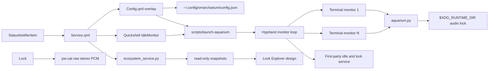

# Architecture

Omarcharium deliberately separates shell integration from the animation process. The Omarchy shell remains long-lived and lightweight; terminal rendering and audio exist only during an immersion.

## Plugin lifecycle

`manifest.json` declares two entry points under one namespaced plugin ID:

- `service`: always loaded while the plugin is enabled;
- `overlay`: loaded by the shell when the control room is summoned.

`Service.qml` owns the tray item, IPC surface, and idle monitor. It launches the renderer rather than embedding animation work in the shared Quickshell process.

## Control room and persistence

`Config.qml` reads packaged defaults and the species catalog, normalizes user input, and atomically writes JSON under `~/.config/omarcharium/`. Every mutation creates a fresh QML object before assignment; this avoids silent change-notification loss from mutating nested `var` objects in place.

The Python renderer independently normalizes the same public configuration contract. A malformed or partially written user file therefore falls back safely without preventing the screensaver from opening.

The ecosystem service keeps its authoritative model in memory. `scripts/ecosystem_checkpoint.py`
provides the persistence seam: `CheckpointStore` loads a validated model at startup
and writes compact JSON checkpoints, while `CheckpointScheduler` coalesces dirty
updates. Normal checkpoints occur no more than once every five minutes; reset,
simulation-setting changes, explicit saves, and clean shutdown force a checkpoint.

The default service cadence is one fixed biological minute every 60 wall-clock
seconds. Maturity is 720 biological minutes (12 hours) and reproduction cooldown
is 240 biological minutes (4 hours). The optional diagnostic acceleration multiplies
the cadence by 10; normal operation therefore remains suitable for hours- or
days-long unattended sessions.

`scripts/ecosystem_service.py` owns the process boundary. It advances fixed-size
ticks from monotonic elapsed time, serves newline-delimited JSON requests over a
mode-`0600` Unix socket, and uses a private non-blocking lock so only one service
can own the world. `snapshot` responses are encoded directly from the in-memory
model; `reset`, `settings`, and `save` are the only mutating protocol operations.
Malformed requests receive a bounded JSON error response and cannot reach the
model transition seam.

Checkpoint writes are bounded, flushed, and atomically replaced from a temporary
file in the same private directory. A failed write raises to the service and leaves
the dirty flag set for retry. Renderers receive read-only in-memory snapshots over
IPC and never read the checkpoint file, so monitor count and frame rate do not
increase filesystem activity.

## Renderer

`OceanScene` renders the terminal-native fixed layer stack:

1. background source (Plain Depth, Pelagic Field, or Custom Image);
2. optional pelagic current, scanline, and particle effects;
3. water and habitat;
4. fish;
5. local status display.

Backdrop effects are independent from the source so the same bounded terminal-native treatment can compose over built-in and user-selected sources. Each frame then advances positions from monotonic time, wraps entities at scene boundaries, paints into a cell buffer, emits ANSI truecolor only when the active foreground color changes, and erases the unpainted remainder of every row.

For **Custom Image**, `RasterBackdrop` canonicalizes and size-checks a local allowlisted image, forces ImageMagick to the matching JPEG, PNG, GIF, BMP, or WebP decoder, and preprocesses it once with memory, map, disk, pixel, and timeout bounds. A global no-follow cache lock serializes conversion. The cache key includes the canonical path, size, modification time, fit, and dimming; mode-`0600` outputs are pruned to 16 files and 128 MiB. Ghostty and Kitty receive the resulting PNG through a negative-z Kitty graphics placement; resize sends a new placement without decoding again. Alacritty and Foot retain the terminal-native layers and show a plain-depth fallback notice.

Sprites contain only single-cell glyphs. A mirror translation reverses direction without maintaining duplicate left-facing art. `--seed` makes snapshots deterministic for tests and visual debugging.
The terminal enters an alternate screen, hides the cursor, and enables SGR any-motion mouse reporting. A bounded input decoder distinguishes pointer motion from clicks and keyboard bytes, including fragmented reports. Cleanup restores every terminal mode on normal exit or signal. Accepted dismissal input closes all monitor instances through the standard Omarchy screensaver class.

## Multi-monitor and lock integration

`scripts/launch-aquarium` follows Omarchy's first-party screensaver launch pattern:

- remembers the focused monitor;
- opens the Hyprland event socket before launching;
- focuses each monitor and dispatches one supported terminal;
- waits for its `org.omarchy.screensaver` window before advancing;
- restores the original monitor focus.

The first-party idle service still owns locking. Omarcharium uses the same configured screensaver timeout and standard window class, so Omarchy observes active screensaver windows and preserves the configured lock deadline.

The lock design requests the same in-memory service snapshot as every other
renderer and passes it through `ecosystem_view.view()`. Its Canvas draws the
projected resources and organisms without ticking, persisting, or accepting
authentication input. One outstanding request is allowed at a time; requests
stop while the lock host blanks the display. A service failure produces an
empty frame while Lock Explorer continues to own the password field.

To suppress only the stock visualizer, `scripts/idle-integration` creates the existing `screensaver-off` toggle when absent and records ownership separately. It never claims an existing toggle and removes only owned state.

## Audio

Every renderer may request ambience, but `AmbientAudio` takes a non-blocking no-follow `flock` on a mode-`0600` regular file. Only one monitor becomes the audio leader. The lock lives in a mode-`0700` `$XDG_RUNTIME_DIR/omarcharium/` directory, or a private cache fallback if no absolute runtime directory is available. Audio streams generated signed 16-bit stereo PCM at 24 kHz to `pw-cat --raw`; no sample assets or codecs are involved.

The synthesis provides independently toggled continuous water motion and sparse frequency-rising bubble envelopes. `--audio-test` adds three diagnostic tones and verifies that `pw-cat` remains alive before reporting success.

| Resource | Access |
|---|---|
| Plugin source | Read-only at runtime |
| `~/.config/omarcharium/config.json` | Atomic user configuration read/write; directory mode `0700`; renderer input capped at 256 KiB |
| Selected backdrop image | Local read-only allowlisted input; 32 MiB and 24 megapixel limits |
| `~/.cache/omarcharium/` | Private derived backdrop PNGs, global no-follow cache lock, 16-file/128 MiB ceiling |
| `~/.local/state/omarcharium/` | Private matched toggle ownership marker |
| `~/.local/state/omarcharium/ecosystem.json` | Compact, atomically replaced ecosystem recovery checkpoint; written at most every five minutes except forced saves |
| `$XDG_RUNTIME_DIR/omarcharium/audio.lock` | Private no-follow ephemeral audio leadership lock |
| `/usr/share/omarchy/` | Read-only terminal defaults; never modified |
| Network | No runtime requests; a fixed bug-report URL opens only after user action |
| Privilege escalation | Never used |
