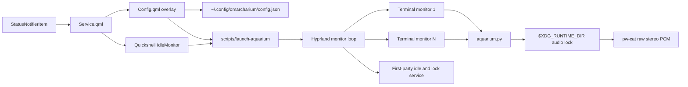

# Architecture

Omarcharium deliberately separates shell integration from the animation process. The Omarchy shell remains long-lived and lightweight; terminal rendering and audio exist only during an immersion.

## Plugin lifecycle

`manifest.json` declares two entry points under one namespaced plugin ID:

- `service`: always loaded while the plugin is enabled;
- `overlay`: loaded by the shell when the control room is summoned.

`Service.qml` owns the tray item, IPC surface, and idle monitor. It launches the renderer rather than embedding animation work in the shared Quickshell process.

## Control room and persistence

`Config.qml` reads packaged defaults and the species catalog, normalizes user input, and atomically writes JSON under `~/.config/omarcharium/`. Every mutation creates a fresh QML object before assignment; this avoids silent change-notification loss from mutating nested `var` objects in place.

The Python renderer independently normalizes the same public configuration contract. A malformed or partially written user file therefore falls back safely without preventing the screensaver from opening.

## Renderer

`OceanScene` renders a fixed layer stack:

1. background source;
2. optional pelagic current, scanline, and particle effects;
3. water and habitat;
4. fish;
5. telemetry.

Backdrop effects are independent from the source so the same bounded terminal-native treatment can compose over built-in and user-selected sources. Each frame then advances positions from monotonic time, wraps entities at scene boundaries, paints into a cell buffer, emits ANSI truecolor only when the active foreground color changes, and erases the unpainted remainder of every row.

For Custom Image, `RasterBackdrop` validates a local bounded image and preprocesses it once through ImageMagick. The cache key includes the canonical path, size, modification time, fit, and dimming. Ghostty and Kitty receive the resulting PNG through a negative-z Kitty graphics placement; resize sends a new placement without decoding again. Alacritty and Foot retain the terminal-native layers and show a plain-depth fallback notice.

Sprites contain only single-cell glyphs. A mirror translation reverses direction without maintaining duplicate left-facing art. `--seed` makes snapshots deterministic for tests and visual debugging.

The terminal enters an alternate screen, hides the cursor, and enables SGR any-motion mouse reporting. A bounded input decoder distinguishes pointer motion from clicks and keyboard bytes, including fragmented reports. Cleanup restores every terminal mode on normal exit or signal. Accepted dismissal input closes all monitor instances through the standard Omarchy screensaver class.

## Multi-monitor and lock integration

`scripts/launch-aquarium` follows Omarchy's first-party screensaver launch pattern:

- remembers the focused monitor;
- opens the Hyprland event socket before launching;
- focuses each monitor and dispatches one supported terminal;
- waits for its `org.omarchy.screensaver` window before advancing;
- restores the original monitor focus.

The first-party idle service still owns locking. Omarcharium uses the same configured screensaver timeout and standard window class, so Omarchy observes active screensaver windows and preserves the configured lock deadline.

To suppress only the stock visualizer, `scripts/idle-integration` creates the existing `screensaver-off` toggle when absent and records ownership separately. It never claims an existing toggle and removes only owned state.

## Audio

Every renderer may request ambience, but `AmbientAudio` takes a non-blocking `flock`. Only one monitor becomes the audio leader. It streams generated signed 16-bit stereo PCM at 24 kHz to `pw-cat --raw`; no sample assets or codecs are involved.

The synthesis combines slowly filtered noise, water motion, and sparse frequency-rising bubble envelopes. `--audio-test` adds three diagnostic tones and verifies that `pw-cat` remains alive before reporting success.

| Resource | Access |
|---|---|
| Plugin source | Read-only at runtime |
| `~/.config/omarcharium/config.json` | User configuration read/write |
| Selected backdrop image | Local read-only input |
| `~/.cache/omarcharium/` | Bounded derived backdrop PNGs and locks |
| `~/.local/state/omarcharium/` | Toggle ownership marker |
| `$XDG_RUNTIME_DIR/omarcharium-audio.lock` | Ephemeral audio leadership lock |
| `/usr/share/omarchy/` | Read-only terminal defaults; never modified |
| Network | Never accessed |
| Privilege escalation | Never used |
